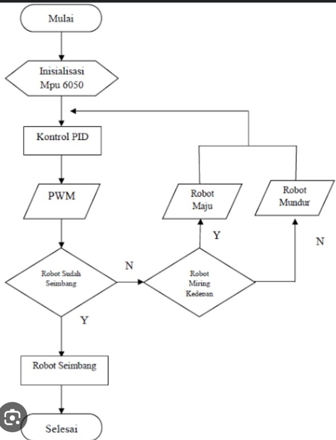

# Self-Balancing-Robot-with-Tunning-PID

### Project 
- Self Balancing Robot
  Self Balancing robot (balancing robot) is a mobile robot with two wheels on the right and left sides which is designed to be able to maintain balance automatically without the need for human intervention. The robot will not be balanced if it is not controlled during its movement. Balancing robot is a development of the inverted pendulum model which is placed on a wheeled robot. In this case the control method used is the PID (proportional integral derivative) control method.
  
  
  
- PID
  PID is a general control method used in automation and control systems which aims to regulate a system or process so that it can achieve the desired target or setpoint.
  Proportional (P): helps reduce proportional errors and accelerates reaching the setpoint value.
  Integral (I): functions to overcome integral errors over time. and produces a smoother and more stable response at steady state conditions.
  Derivative (D): derivative components help prevent overshoot and increase system stability.
  
  

---
### How it works?

### The Methode

### The Hardware Design
Hardware use :
- WEMOS D1 MINI
- MPU6050
- L298N
- AMS11
- DC Motor + Gearbox + Wheel
- Battery
- PCB
- Jumper Cables
- Switch
  

### The 3D Design

### The Prototype

