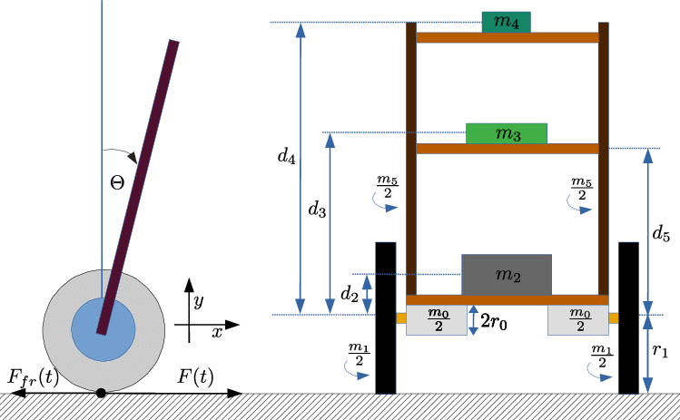
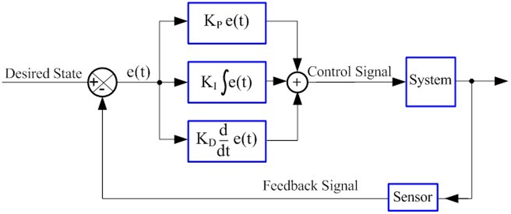
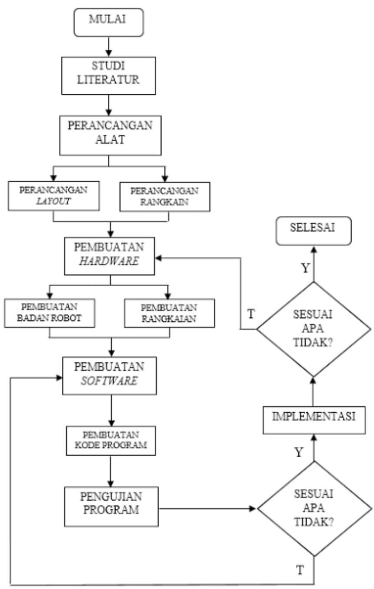
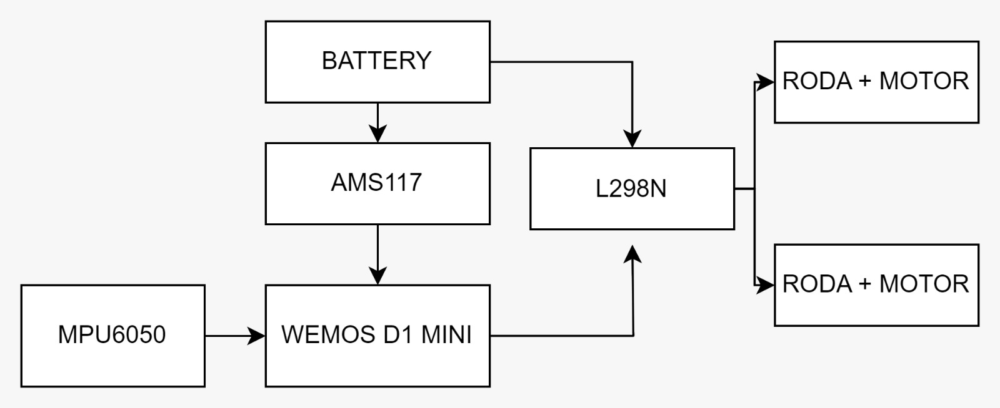
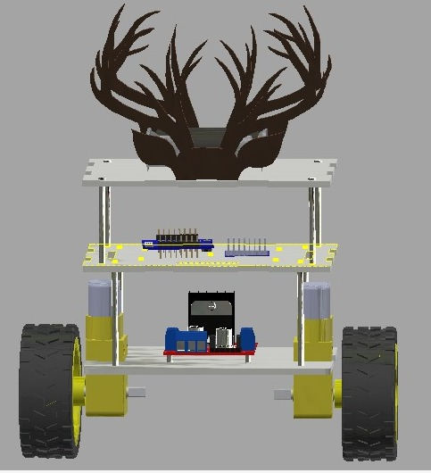
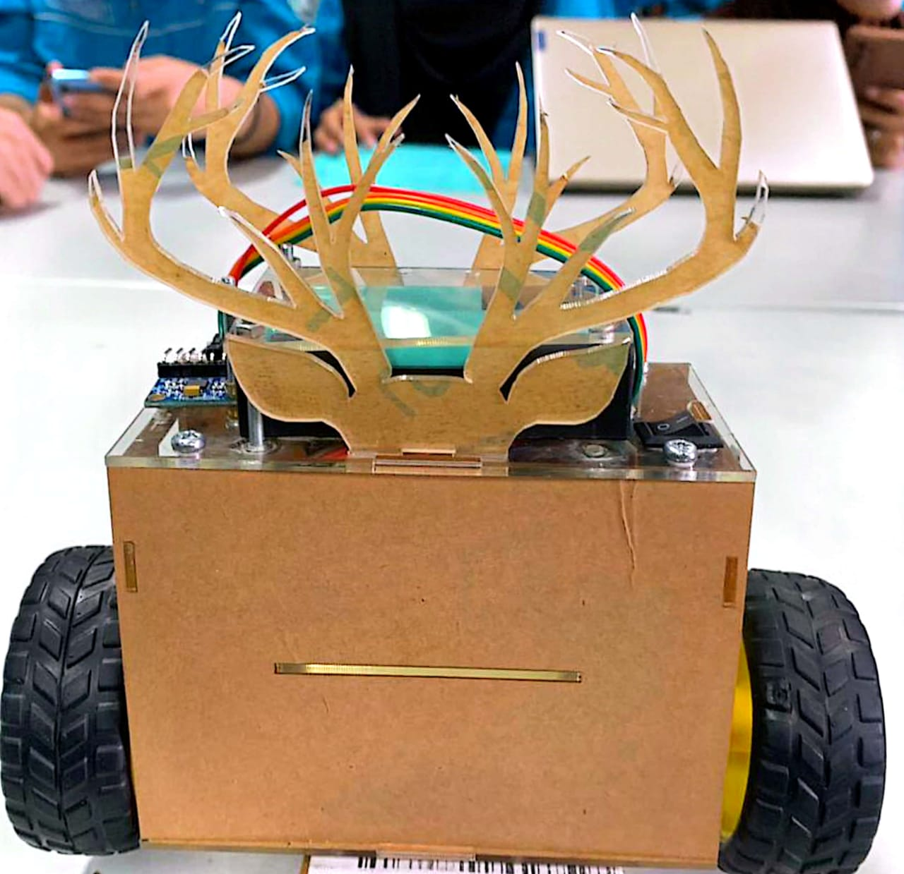

# Self-Balancing-Robot-with-Tunning-PID

### Project 
- Self Balancing Robot
  Self Balancing robot (balancing robot) is a mobile robot with two wheels on the right and left sides which is designed to be able to maintain balance automatically without the need for human intervention. The robot will not be balanced if it is not controlled during its movement. Balancing robot is a development of the inverted pendulum model which is placed on a wheeled robot. In this case the control method used is the PID (proportional integral derivative) control method.
  
  
  
- PID
  PID is a general control method used in automation and control systems which aims to regulate a system or process so that it can achieve the desired target or setpoint.
  Proportional (P): helps reduce proportional errors and accelerates reaching the setpoint value.
  Integral (I): functions to overcome integral errors over time. and produces a smoother and more stable response at steady state conditions.
  Derivative (D): derivative components help prevent overshoot and increase system stability.
  
  

---
### How it works?
1. The MPU6050 sensor equipped with an accelerometer and gyroscope is a key component in the self-balancing robot. An accelerometer measures acceleration, while a gyroscope measures the rate of change in angle. With information from these two sensors, the robot can know its position and movement.
2. Data from the sensors is sent to the WEMOS D1 MINI microcontroller to process information quickly. This microcontroller is programmed and equipped with a PID (Proportional, Integral, Derivative) control algorithm to regulate robot movement and maintain balance.
3. The PID algorithm is used to create an automatic control system that is responsive to changes in position and movement. In self-balancing robots, the PID algorithm helps calculate the error between the actual position and the desired position, then adjusts the motor speed to reduce this error.
4. The WEMOS D1 MINI microcontroller uses information from the MPU6050 sensor to control the speed of each motor independently to maintain the robot's balance. If the robot starts to tilt forward or backward, the microcontroller will adjust the wheel speed to correct its position.

### The Methode

### The Hardware Design
Hardware use :
- WEMOS D1 MINI
- MPU6050
- L298N
- AMS11
- DC Motor + Gearbox + Wheel
- Battery
- PCB
- Jumper Cables
- Switch
  

### The 3D Design

### The Prototype

